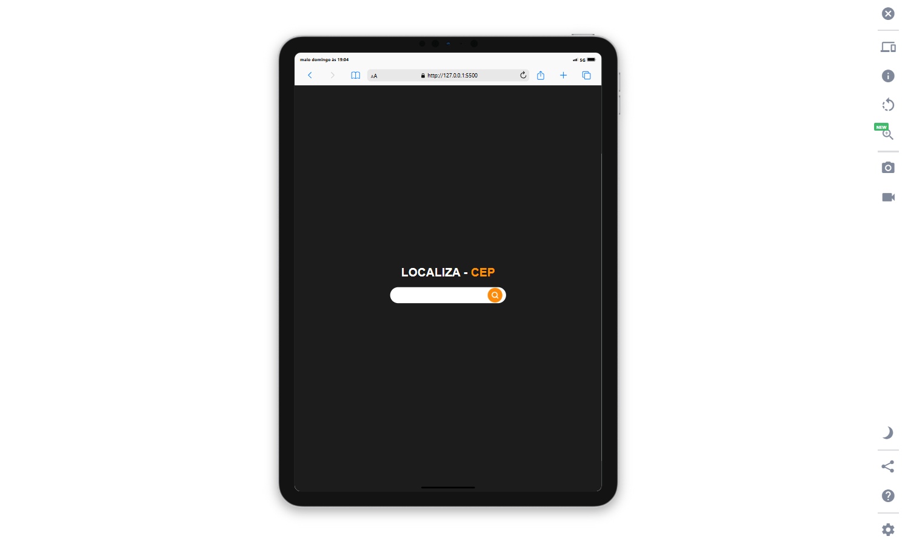

# Localiza Cep

Este é o meu projeto **Localiza Cep**, uma aplicação simples e responsiva feita com **HTML**, **CSS** e **JavaScript**. O objetivo é proporcionar uma maneira prática de consultar endereços a partir do CEP, consumindo a API do Via Cep.

## 💡 Sobre o Projeto

Neste projeto você encontrará:

- Consulta de CEPs com a API do Via Cep.
- Responsividade, adaptando-se bem a diferentes tamanhos de tela.
- Aplicação de técnicas modernas de CSS, como grid, flexbox e pseudo-elementos.
- Animações e interações com JavaScript puro (vanilla JS), sem dependência de frameworks.

## 🔗 Acesse o Projeto

**Visite o meu projeto:**
[https://baestero.github.io/Localiza-CEP/](https://baestero.github.io/Localiza-CEP/)

## 🖼 Preview

Adicionei abaixo um preview do projeto para visualização rápida:
**(substitua o link abaixo pela URL da imagem desejada)**



## 🛠 Tecnologias Utilizadas

- HTML5
- CSS3
- JavaScript (Vanilla)

## 🧪 Como Executar Localmente

1. Clone o repositório:

   ```bash
   git clone https://github.com/baestero/localiza-cep.git
   ```

2. Acesse a pasta do projeto:

   ```bash
   cd localiza-cep
   ```

3. Abra o arquivo `index.html` diretamente no navegador.

## 👨‍💻 Autor

Projeto desenvolvido por **Leonardo Baestero**
GitHub: [https://github.com/baestero](https://github.com/baestero)

---
